# AI Copilot for IT Operations (AWS Hybrid Delivery)

## 📋 Executive Summary
**Objective:** Design and deploy an AI-powered Retrieval-Augmented Generation (RAG) copilot on AWS to accelerate incident resolution (MTTR) and reduce engineer onboarding time.

**Key Outcomes:**
*   **30% Reduction** in Mean Time To Resolution (MTTR).
*   **25% Faster** Onboarding for new NOC Engineers.
*   **$100k+ Annual Savings** via automated Level 1 support.

## 🏗️ System Architecture
The solution leverages a **Serverless RAG Architecture** on AWS, ensuring data sovereignty and high scalability.

```mermaid
%% AI Copilot Architecture – AWS Version
graph LR
classDef layer fill:#e3f2fd,stroke:#1565c0,stroke-width:2px,color:#000,font-weight:bold;
classDef component fill:#ffffff,stroke:#424242,stroke-width:1px,color:#000;
classDef data fill:#fff3e0,stroke:#ef6c00,stroke-width:1px,color:#000;
classDef process fill:#e8f5e9,stroke:#2e7d32,stroke-width:1px,color:#000;
classDef security fill:#f3e5f5,stroke:#6a1b9a,stroke-width:1px,color:#000;
classDef external fill:#ede7f6,stroke:#4527a0,stroke-width:1px,color:#000;
classDef monitor fill:#e1f5fe,stroke:#0288d1,stroke-width:1px,color:#000;
classDef ragretrieval fill:#ffe0b2,stroke:#ef6c00,stroke-width:2px,color:#000;
classDef raggeneration fill:#c8e6c9,stroke:#2e7d32,stroke-width:2px,color:#000;
classDef consumer fill:#fff9c4,stroke:#fbc02d,stroke-width:2px,color:#000;

%% ================================
%% USER INTERFACE / CONSUMER LAYER
%% ================================
subgraph UI["User Interface / Consumer Layer"]
    NOC["NOC Engineer"]:::component
    SLACK["Slack App / Operations Copilot"]:::consumer
    ONBOARD["Onboarding Portal / Learning Assistant"]:::consumer
    NOC -->|Asks Operational Query| SLACK
end
class UI layer

%% ================================
%% API & SECURITY LAYER
%% ================================
subgraph API["API & Security Layer"]
    GATEWAY["AWS API Gateway / ALB"]:::security
    AUTH["AWS IAM Identity Center / Okta"]:::security
    JWT["Validates JWT Token"]:::security
    ROUTE["Routes Request"]:::process
    GATEWAY --> JWT --> AUTH --> GATEWAY
    GATEWAY --> ROUTE
end
class API layer

%% ================================
%% ORCHESTRATION LAYER (RAG CORE)
%% ================================
subgraph ORCH["Orchestration Layer (RAG Core)"]
    EKS["Amazon EKS (Kubernetes)"]:::component
    FASTAPI["Python FastAPI (RAG Orchestrator)"]:::component
    OPENSEARCH["Amazon OpenSearch (Vector Engine)"]:::ragretrieval
    DOCS["Relevant Docs / Snippets (Retrieved Context)"]:::data
    BEDROCK["AWS Bedrock (Claude 3 / Llama)"]:::raggeneration
    EKS --> FASTAPI
    FASTAPI --> OPENSEARCH
    OPENSEARCH --> DOCS
    FASTAPI --> BEDROCK
    BEDROCK --> FASTAPI
end
class ORCH layer

%% ================================
%% MONITORING & LOGGING LAYER
%% ================================
subgraph MON["Monitoring & Logging Layer"]
    XRAY["AWS X-Ray Tracing"]:::monitor
    CLOUDWATCH["Amazon CloudWatch Logs"]:::monitor
    ALARMS["CloudWatch Alarms"]:::monitor
    XRAY --> CLOUDWATCH --> ALARMS
end
class MON layer

%% ================================
%% DATA INGESTION LAYER
%% ================================
subgraph DATA["Data Ingestion Layer (RAG Preprocessing)"]
    SRC["Source Data (ServiceNow, Confluence, Git)"]:::data
    ETL["AWS Glue / Lambda Functions"]:::process
    EMBED["Text Embeddings via AWS Bedrock (Titan)"]:::ragretrieval
    SRC --> ETL --> EMBED --> OPENSEARCH
end
class DATA layer

%% ================================
%% EXTERNAL SYSTEMS
%% ================================
subgraph EXT["External Systems"]
    SNOW["ServiceNow API"]:::external
end
class EXT layer

%% ================================
%% CONNECTIONS ACROSS LAYERS
%% ================================
SLACK -->|Operational Query| GATEWAY
ONBOARD -->|Learning Query / Knowledge Request| GATEWAY

GATEWAY -->|Routes Request| EKS
FASTAPI -->|Retrieves Context| OPENSEARCH
OPENSEARCH -->|Returns Snippets| FASTAPI
FASTAPI -->|Augments Prompt & Generates Response| BEDROCK
BEDROCK -->|Grounded Answer| FASTAPI
FASTAPI -->|Formats Final Answer| GATEWAY
GATEWAY -->|Sends Response| SLACK
GATEWAY -->|Provides Summarized Knowledge| ONBOARD
FASTAPI -->|Optional Action| SNOW

FASTAPI -->|Telemetry| XRAY
EKS -->|Performance Metrics| CLOUDWATCH
GATEWAY -->|Security Logs| CLOUDWATCH
ALARMS -->|Notifications| NOC

%% ================================
%% LEGEND (THREE CATEGORIES)
%% ================================
subgraph LEGEND["Legend"]
    RAG1["🟧 Retrieval Components (OpenSearch, Glue, Embeddings)"]:::ragretrieval
    RAG2["🟩 Generation Components (AWS Bedrock, FastAPI Logic)"]:::raggeneration
    CONSUME["🟨 Consumer / Enablement Layer (Slack & Onboarding Portal)"]:::consumer


end
```

## 🛠️ Technology Stack
*   **Compute:** Amazon EKS (Orchestration), AWS Lambda (Event Processing)
*   **AI/ML:** AWS Bedrock (Claude 3 Sonnet), Amazon Titan (Embeddings)
*   **Data:** Amazon OpenSearch (Vector DB), AWS Glue (ETL Pipelines)
*   **Security:** AWS IAM Identity Center, VPC PrivateLink, Okta Integration
*   **Observability:** Amazon CloudWatch, AWS X-Ray, CloudWatch Alarms

## 📚 Documentation
Detailed documentation regarding the program execution, phases, risk management, and delivery strategy.

*   📄 **[Full Program Plan & Execution Strategy](./docs/program-plan.md)**
    *   *Detailed breakdown of the 6-phase delivery, resource allocation, testing strategy, and risk mitigation strategies.*

---
*Authored by Mohammad Maniruzzaman*

